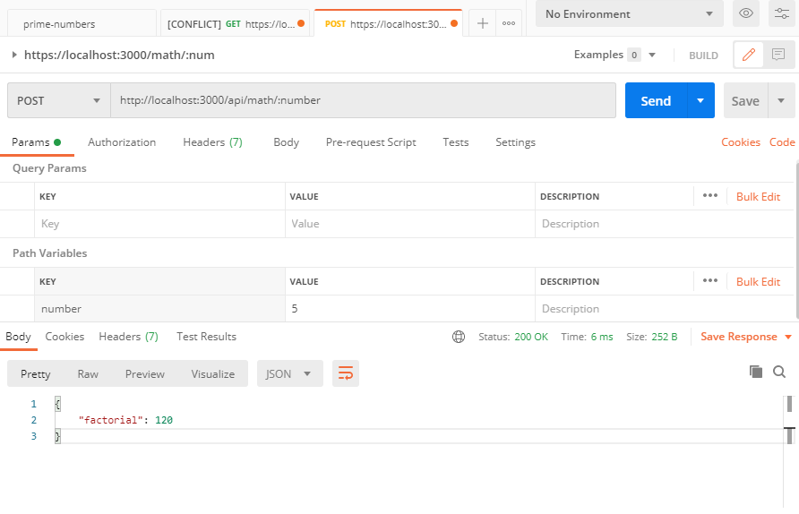

**NODEJS EXPRESS FACTORIAL GENERATOR API**
 
[](https://travis-ci.org/hagopj13/node-express-boilerplate)
[](https://coveralls.io/github/hagopj13/node-express-boilerplate?branch=master)
[](https://www.codacy.com/manual/hagopj13/node-express-mongoose-boilerplate?utm_source=github.com&utm_medium=referral&utm_content=hagopj13/node-express-boilerplate&utm_campaign=Badge_Grade)
[](http://makeapullrequest.com)

----
 Using this API you can get Factorail of any given number 
 
 
 
 
 
 ## Manual Installation

If you would still prefer to do the installation manually, follow these steps:

#### Clone the repo:

```bash
git clone https://github.com/wishwagayan/factorial-api.git
cd factorial-api
```
#### Lets Instiliaize Nodejs
```bash
npm init
```
#### Now Run The Project in Dev
```bash
npm run dev
```
## Setup
* **URL**

  http://localhost:3000/api/math/{Number}

* **Method:**
  
  `GET` 
*  **URL Params**
  You need to proide number which is you wnat to get factorial 


* **Notes:**

  <_This is where all uncertainties, commentary, discussion etc. can go. I recommend timestamping and identifying oneself when leaving comments here._> 
